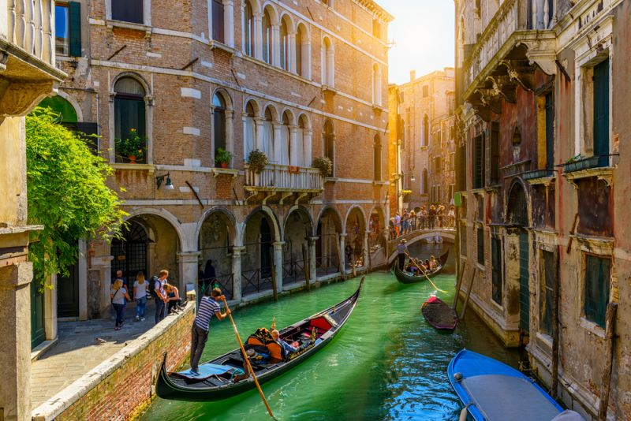

<!DOCTYPE html>
<html lang="en">
  <head>
   <title>Travel</title>
   <meta name="viewport" content="width=device-width, initial-scale=1">
   
   

  </head>

  <body>
  
    <a href="aboutme.html" >About Me</a>
     
     

 <form>
<h3> How much can you spend per day on your vacation?</h3>
 
  <input type=radio name=choice id="spend" value=100> Under $100
  <input type=radio name=choice id="spend" value=200> from $100 to $200
  <input type=radio name=choice id="spend" value=300> from $200 to $300
  <input type=radio name=choice id="spend" value=400> from $300 to $400
  <input type=radio name=choice id="spend" value=500> from $400 to $500
  <input type=radio name=choice id="spend" value=600> Above $500
</form>
 
<form>
<h3> Continent? </h3>
  <input type=radio name=choice id="continent" value=North_America>North America
  <input type=radio name=choice id="continent" value=South_America>South America
  <input type=radio name=choice id="continent" value=Europe>Europe
  <input type=radio name=choice id="continent" value=Asia>Asia
  <input type=radio name=choice id="continent" value=Africa>Africa
  <input type=radio name=choice id="continent" value=Oceania>Oceania
  <input type=radio name=choice id="continent" value=no_preference>No preference
</form>
 
<form>
  <h3> English speaking country:</h3>
   
  <input type=radio name=choice id="language" value=yes>Yes
  <input type=radio name=choice id="language" value=no>No
  <input type=radio name=choice id="language" value=not_necessary>No preference
</form>
 
<form>
 
<form>
  <h3> Climate?</h3>
   
<input type=radio name=choice id="climate" value=Oceanic>Oceanic
<input type=radio name=choice id="climate" value=Mediterranean>Mediterranean
<input type=radio name=choice id="climate" value=Continental>Continental
<input type=radio name=choice id="climate" value=HumidSubtropical>Humid Subtropical
<input type=radio name=choice id="climate" value=Hot-summerMediterranean>Hot-summer Mediterranean
<input type=radio name=choice id="climate" value=TropicalSavanna>Tropical Savanna

</form>
 
<form>
  <h3>Temperature preferences</h3>
  <input type=text id=temperature>
</form>
 
 
  <button onclick="quiz()">submit</button>

  

    

      ×
      <h2>What to do in France?</h2>
    

    

      
       <ul>
       <li>Visit the Louvre museum</li>
       <li>Make a Pilgrimage to Mont Saint-Michel</li>
       <li>Attend the Royal Serenade at the Château de Versailles</li>
       <li>Learn to Cook Classic French Cuisine in Burgundy</li>
       <li>Bike around Bordeaux</li>
       <li>Shop at the Colorful Markets of Aix-en-Provence</li>
       <li>visit the Eiffel Tower</li>
       <li>Cruise the Seine River</li>
       <li>Visit the Notre-Dame Cathedral</li>
      </ul>
    

    

    

      <a href="https://uk.france.fr/en">More about France</a>
    

  

  

    

      ×
      <h2>What to do in Germany?</h2>
    

    

       
       <ul>
         <li>Check out the Berlin Wall</li>
         <li>Visit the Reichstag Building</li>
         <li>Hike Berchtesgaden National Park</li>
         <li>Explore the mysterious Black Forest</li>
         <li>Visit the Cologne Cathedral</li>
         <li>Go to Oktoberfest</li>
         <li>Try sausage and beer</li>
         <li>Visit the Holocaust Memorial</li>
         <li>Swim in the Konigsee</li>
       </ul>
    

    

      <a href="https://www.germany.travel/en/home.html">More about Germany</a>
    

  

  

  

    

      ×
      <h2>What to do in Italy?</h2>
    

    

      
      <ul>
        <li>Hike the Cinque Terre</li>
        <li>Make pasta in Florence</li>
        <li>Watch opera in Verona's Roman Arena</li>
        <li>Visit the Colosseum</li>
        <li>Tour lake Como by boat</li>
        <li>Attend Carnevale</li>
        <li>Ski at the Dolomites</li>
        <li>Trek through Sardinia</li>
      </ul>
    

    

      <a href="http://www.italia.it/en/home.html">More about Italy</a>
    

  

  

    

      ×
      <h2>What to do in Taiwan?</h2>
    

    

      
      <ul>
        <li>Check out Taipei 101</li>
        <li>Street Food</li>
        <li>Visit National Palace Museum</li>
        <li>Visit a night market</li>
        <li>Experience tea culture</li>
        <li>Hot Springs</li>
        <li>Explore Green Moutains</li>
        <li>Go hiking in Taroko National Park</li>
      </ul>
    

    

      <a href="https://eng.taiwan.net.tw/">More about Taiwan</a>
    

  

  

    

      ×
      <h2>What to do in Singapore?</h2>
    

    

      
      <ul>
        <li>Check out Gardens By the Bay</li>
        <li>Visit Merlion Park</li>
        <li>Visit Thian Hock Keng</li>
        <li>Go to Night Safari</li>
        <li>Watch concert at Esplanade</li>
        <li>Eat at Old Airport Road Food Centre</li>
        <li>Visit Universal Studios Singapore</li>
      </ul>
    

    

      <a href="https://www.stb.gov.sg/content/stb/en.html">More about Singapore</a>
    

  

  

    

      ×
      <h2>What to do in Spain?</h2>
    

    

      
      <ul>
        <li>Visit Alhambra in Granada</li>
        <li>Discover Catalan modernism</li>
        <li>Go to summer music festivals</li>
        <li>Try walking along the Caminito del Rey in Málaga</li>
        <li>Check out Madrid's gastro markets</li>
        <li>Swim at Papagayo Beach on Canary Island of Lanzarote</li>
        <li>Drink Rioja in La Rioja</li>
        <li>Join a cider party in Asturias</li>
        <li>Try torreznos in Soria</li>
      </ul>
    

    

      <a href="https://www.spain.info/en/">More about Spain</a>
    

  

  

    

      ×
      <h2>What to do in China?</h2>
    

    

      
      <ul>
        <li>Ride Through Beijing in a Sidecar</li>
        <li>Join a morning Tai Chi group</li>
        <li>Play with Panda</li>
        <li>Take a Gondola Through One of China's Ancient Water Towns</li>
        <li>Try a Sichuan Hot Pot in Sichuan</li>
        <li>Experience Chinese New Year in the Capital City</li>
        <li>Drink Oil Tea with Ethnic Minorities up on the Rice Terraces near Guilin</li>
        <li>Climb the Great Wall</li>
      </ul>
    

    

      <a href="https://www.discoverchina.com/article/china-tourism">More about China</a>
    

  

  

    

      ×
      <h2>What to do in Hong Kong?</h2>
    

    

      
      <ul>
        <li>Check out Cat Street market</li>
        <li>Visit Chi lin Nunnery</li>
        <li>Eat at Maxim's Palace</li>
        <li>Visit Aqualuna Symphony of Lights Cruise</li>
        <li>Ride the longest escalator in the World</li>
        <li>Party In Lan Kwai Fong</li>
        <li>Ride on a Traditional Chinese Junk Boat</li>
        <li>Visit 10,000 Buddhas Monastery</li>
        <li> Hike Dragon’s Back</li>
      </ul>
    

    

      <a href="https://www.discoverhongkong.com/eng/index.html">More about Hong Kong</a>
    

  

   
   
    <form>
      <input type="Text" placeholder="Full Name">
      <input type="email" placeholder="Email">
      <textarea></textarea>
      <button>Submit</button>
    </form>
  </body>
  </html>
  
